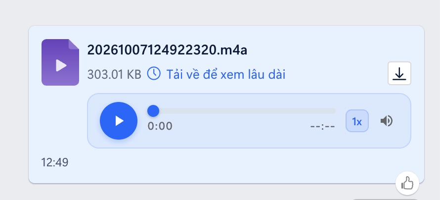

# 🎵 Zalo Web Audio Player (Chrome Extension)

Trình tiện ích mở rộng (Extension) dành cho trình duyệt Chrome, Cốc Cốc, Edge, Brave giúp **phát trực tiếp các file ghi âm và file âm thanh** (như `.m4a`, `.mp3`, `.wav`, `.aac`, `.ogg`, `.flac`...) ngay trong giao diện chat Zalo Web ([chat.zalo.me](https://chat.zalo.me/)) mà **không cần phải tải file về máy tính**.

---

## 📸 Giao diện thực tế



*Trình phát nhạc được tích hợp trực tiếp ngay trong khung tin nhắn file đính kèm trên Zalo Web.*

---

## 🌟 Tính Năng Nổi Bật

- 🎵 **Phát âm thanh trực tuyến (Online Audio Player)**: Tự động nhận diện tin nhắn đính kèm file âm thanh và gắn thanh điều khiển phát nhạc đẹp mắt ngay bên dưới tên file.
- ⚡ **Không làm rác thư mục Downloads**: Cơ chế bắt chặn luồng tải thông minh giúp phát file trực tiếp từ bộ nhớ đệm (stream blob/memory), không tự động lưu file về thư mục Downloads của máy tính khi bấm nghe.
- 🎛 **Đầy đủ phím chức năng tiện lợi**:
  - Nút **Play / Pause** mượt mà, có vòng xoay chờ (spinner) khi đang nạp âm thanh.
  - Thanh kéo tua thời gian (**scrubber**) cho phép tua nhanh/lùi đến chính xác đoạn cần nghe.
  - Hiển thị thời gian thực và thời lượng file (`0:00 / 0:15`).
  - Nút đổi tốc độ phát nhanh: **`1x`**, **`1.25x`**, **`1.5x`**, **`2x`** (rất tiện khi nghe các bản ghi âm dài).
  - Nút Tắt/Bật nhanh âm thanh (**Mute / Unmute**).
- 💾 **Bảo toàn nút "Lưu về máy" (Download)**: Nếu bạn thực sự muốn lưu file về máy tính, nút biểu tượng tải xuống (mũi tên tải về) ở góc phải tin nhắn vẫn hoạt động bình thường.
- 🌓 **Tương thích giao diện Sáng & Tối (Light / Dark mode)** của Zalo Web.
- 🛡 **Bảo mật tuyệt đối 100%**: Tiện ích chạy hoàn toàn cục bộ (offline) trên trình duyệt, không gửi bất kỳ dữ liệu, âm thanh hay nội dung chat nào ra bên ngoài.

---

## 📂 Các định dạng âm thanh hỗ trợ

| Định dạng | Mô tả ví dụ |
| :--- | :--- |
| **`.m4a`** | File ghi âm Voice Memos từ iPhone, iPad (ví dụ: `Bản ghi Mới 10.m4a`) |
| **`.mp3`** | Nhạc MP3 phổ biến |
| **`.wav`** | Âm thanh chất lượng cao Waveform |
| **`.aac`** | Âm thanh chuẩn nén nâng cao |
| **`.ogg` / `.opus`** | Định dạng nén âm thanh mã nguồn mở |
| **`.flac`** | Nhạc lossless |
| **`.m4r`**, **`.weba`** | File nhạc chuông, web audio |

---

## 🚀 Hướng Dẫn Cài Đặt Lên Máy Tính (Dành cho mọi người dùng)

Bạn có thể cài đặt tiện ích này trên máy tính sử dụng hệ điều hành **Windows, macOS hoặc Linux** với các trình duyệt nhân Chromium (Google Chrome, Cốc Cốc, Microsoft Edge, Brave...).

### Bước 1: Tải mã nguồn về máy tính
- **Cách 1 (Tải file ZIP)**: Tải toàn bộ thư mục tiện ích về máy dưới dạng `.zip`, sau đó giải nén ra một thư mục cố định trên máy tính (ví dụ lưu tại: `Documents/Zalo chrome ext` hoặc `Desktop/Zalo chrome ext`).
- **Cách 2 (Dành cho lập trình viên - Git Clone)**:
  ```bash
  git clone https://github.com/sf095/zalo-web-audio-player.git
  ```

> [!IMPORTANT]
> **Lưu ý quan trọng**: Hãy để thư mục tiện ích ở một vị trí cố định trên máy tính (như thư mục `Documents` hoặc thư mục làm việc). **Không được xóa hoặc di chuyển** thư mục này sau khi cài, vì trình duyệt sẽ đọc trực tiếp mã nguồn từ thư mục đó mỗi khi hoạt động.

---

### Bước 2: Mở trang quản lý tiện ích trên trình duyệt
Tùy vào trình duyệt bạn đang sử dụng, hãy copy và dán đường dẫn tương ứng sau vào thanh địa chỉ rồi nhấn **Enter**:

- **Google Chrome / Brave**:
  ```text
  chrome://extensions/
  ```
- **Cốc Cốc**:
  ```text
  coccoc://extensions/
  ```
- **Microsoft Edge**:
  ```text
  edge://extensions/
  ```

---

### Bước 3: Bật "Chế độ dành cho nhà phát triển" (Developer mode)
- Tìm công tắc **"Chế độ dành cho nhà phát triển"** (hoặc **"Developer mode"**) ở góc trên cùng bên phải màn hình.
- Gạt công tắc này sang trạng thái **Bật** (sẽ chuyển sang màu xanh dương).

---

### Bước 4: Tải tiện ích đã giải nén vào trình duyệt
1. Nhìn sang góc trên cùng bên trái màn hình, nhấn vào nút **"Tải tiện ích đã giải nén"** (tiếng Anh là **"Load unpacked"**).
2. Một cửa sổ chọn thư mục sẽ hiện ra:
   - Hãy duyệt và chọn **thư mục tiện ích** mà bạn vừa giải nén ở Bước 1 (thư mục có chứa file `manifest.json`).
   - Nhấn **Select Folder** (hoặc **Chọn thư mục** / **Open**).
3. Tiện ích **"Zalo Web Audio Player - Trình phát âm thanh trực tuyến"** sẽ xuất hiện ngay trong danh sách tiện ích của bạn.

---

### Bước 5: Ghim tiện ích lên thanh công cụ (Tùy chọn)
- Nhấn vào biểu tượng **Mảnh ghép xếp hình** (Tiện ích / Extensions) ở góc trên bên phải thanh công cụ của trình duyệt.
- Nhấn vào biểu tượng **Chiếc ghim (📌)** bên cạnh tiện ích để ghim ra ngoài thanh công cụ giúp bạn dễ dàng bật/tắt hoặc cài đặt khi cần.

---

## 🎧 Hướng Dẫn Sử Dụng & Trải Nghiệm

1. Truy cập vào trang Zalo Web tại: **[https://chat.zalo.me/](https://chat.zalo.me/)**.
   *(Nếu bạn đang mở sẵn Zalo Web, hãy nhấn phím `F5` hoặc tổ hợp `Ctrl + Shift + R` / `Cmd + Shift + R` để tải lại trang).*
2. Bấm vào cuộc trò chuyện có gửi file ghi âm hoặc file âm thanh (ví dụ: `Bản ghi Mới 10.m4a`).
3. Ngay lập tức, bạn sẽ thấy thanh phát âm thanh được tích hợp sẵn bên dưới tên file (như trong ảnh minh họa phía trên).
4. Nhấn nút **Play (▶)** để nghe ngay lập tức!
5. Bạn có thể kéo thanh tua thời gian, bấm `1.5x` hoặc `2x` để nghe nhanh hơn tùy ý.
6. Nếu bạn thực sự muốn lưu file về máy, hãy bấm vào biểu tượng mũi tên tải về ở góc phải tin nhắn như bình thường.

---

## ❓ Câu Hỏi Thường Gặp & Khắc Phục Sự Cố (Troubleshooting)

### 1. Tôi đã cài đặt xong nhưng vào Zalo Web không thấy thanh phát âm thanh?
- **Cách xử lý**:
  - Hãy tải lại trang Zalo Web bằng cách nhấn `Ctrl + F5` (Windows) hoặc `Cmd + Shift + R` (Mac).
  - Kiểm tra lại trang `chrome://extensions/` xem công tắc của tiện ích **Zalo Web Audio Player** có đang ở trạng thái BẬT hay không.
  - Đảm bảo file được gửi trong đoạn chat là các định dạng âm thanh được hỗ trợ (`.m4a`, `.mp3`, `.wav`...).

### 2. Khi tắt máy tính hoặc khởi động lại trình duyệt, tiện ích có bị mất không?
- **Trả lời**: Tiện ích **không** bị mất. Trình duyệt sẽ tự động kích hoạt lại tiện ích mỗi khi bạn mở máy.
- Tuy nhiên, hãy nhớ **không xóa thư mục mã nguồn** mà bạn đã chọn ở Bước 4.

### 3. Làm thế nào để cập nhật khi có phiên bản mới?
- Bạn chỉ cần tải mã nguồn mới về và chép đè vào thư mục hiện tại trên máy tính.
- Sau đó vào lại trang `chrome://extensions/` và nhấn vào biểu tượng **Nạp lại (🔄 Reload)** trên thẻ của tiện ích Zalo Web Audio Player.

---

## ⚙️ Cấu Trúc Thư Mục Dự Án

```
Zalo chrome ext/
├── image.jpeg                 # Ảnh chụp màn hình giao diện thực tế của tiện ích
├── manifest.json              # Cấu hình Chrome Extension Manifest V3
├── content/
│   ├── content.js             # Quét tin nhắn chat, hiển thị giao diện audio player
│   ├── inject.js              # Can thiệp luồng tải Zalo để lấy dữ liệu âm thanh phát online
│   └── styles.css             # Giao diện trình phát chuẩn phong cách thiết kế Zalo Web
├── icons/                     # Bộ biểu tượng ứng dụng (16x16, 48x48, 128x128)
├── popup/                     # Cửa sổ cài đặt khi nhấn vào icon trên thanh công cụ
│   ├── popup.html
│   ├── popup.css
│   └── popup.js
├── README.md                  # Hướng dẫn cài đặt và sử dụng (tài liệu này)
├── SPEC.md                    # Bản đặc tả kỹ thuật chi tiết
├── PLAN.md                    # Kế hoạch phát triển dự án
└── test_suite.py              # Bộ kịch bản kiểm thử tự động
```

---

## 📄 Giấy phép & Tuyên bố miễn trừ trách nhiệm
- Tiện ích này được phát triển độc lập nhằm nâng cao trải nghiệm người dùng trên Zalo Web.
- Tiện ích không liên kết, không thuộc quyền sở hữu của Zalo hay Tập đoàn VNG.
- Toàn bộ quá trình xử lý âm thanh diễn ra hoàn toàn trên trình duyệt của người dùng (Client-side), bảo đảm tối đa tính riêng tư và bảo mật thông tin cá nhân.
